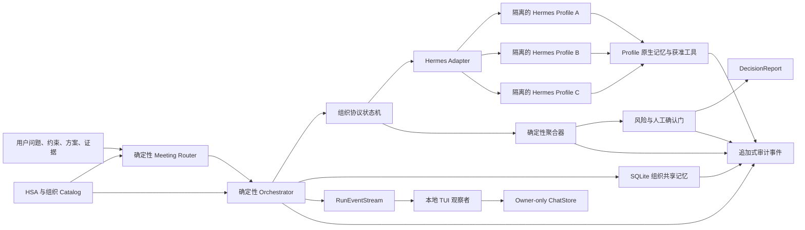

# HSA Think Tank 架构

## 目标与边界

HSA Think Tank 在 Hermes Agent 之上运行多个可追溯的 Hero Soul Agent（HSA），按明确的组织协议形成咨询型决策。HSA 是从公开资料中蒸馏出的决策视角，不是相关人物本人、意识复制品或授权代表。内置人物全部使用 `inspired_synthesis` grounding mode；人物声望不产生额外投票权，也不能替代证据。

系统当前只产出 advisory `DecisionReport`。付款、发布、删除、生产变更、外部消息等高副作用动作不属于 MVP 的自动执行范围。`demo` 后端可以无成本验证协议、聚合、调用限额、记忆和审计；这不等同于运行或验证真实 Hermes 模型。

## 组件与信任边界



责任分离如下：

- Hermes Profile 负责一个 HSA 的研究、记忆检索、工具使用和结构化贡献。
- Meeting Router 根据冻结请求中的显式上下文为现有 HSA 评分，选择基础组织、协议和本次有效席位；它不调用模型。
- Orchestrator 独占会议阶段、可见消息、法定人数、`max_rounds`、`max_invocations`、并发和子进程 timeout 控制。
- Tool Policy 在每次调用前确定有效 toolset 交集；它不是介于 Hermes 每个内部工具调用之间的独立代理。HSA 不能借会议协议直接联系其他 HSA。
- 聚合器只消费已验证的结构化评分和异议，不调用模型决定胜者。
- 风险门把高风险任务、关键未决异议和主席 override 升级为 `needs_human`。

当前实现没有 token 或费用计量/限额，也没有对 Hermes 内部每个工具调用进行独立拦截。不应由“预算”或“Tool Broker”这类抽象名称暗示为已实现。

## 实时事件与聊天边界

`ThinkTank.start_run()` 在启动时复制问题与显式路由快照，并返回 `RunHandle`。调用者可以独立等待 `result()`、订阅事件或显式 `cancel()`；关闭观察订阅不会取消会议。原有 `decide()` 是兼容包装，不要求调用方使用 TUI。

事件流分为三条 lane：

- `activity`：排队、开始、可见响应增量、工具状态和结构校验结果，供观察者选择性投影；
- `audit`：只有进入 `AuditTrail` 哈希链后的权威事件，携带 audit ordinal、event ID 与 hash；
- `control`：`run_finished`、`run_failed` 或 `run_cancelled`，恰好一个终态后关闭流。

同一 wave 内，`agent_output_accepted/rejected` 按 runtime 实际完成顺序立即发布，使快速 HSA 不必等待最慢成员；消息、runtime call record 与权威 audit 仍按协议 task 顺序提交，所以观察延迟不会改变最终报告。`output_delta` 只发给当时在线的订阅者，不进入 replay history；结构校验结果、审计与终态仍可由晚到订阅者回放。每个 live subscriber 默认有 256 条软上限：积压时只允许合并、淘汰或丢弃未验证 delta，audit/control/accepted 等关键事件绝不丢；终态还会清除未消费的 delta backlog。内容优先 TUI 在消息队列边界直接忽略 delta、tool、runtime 与 audit 事件，只将 accepted payload 的自然语言主张、质疑和回应投影到屏幕；底层事件流、权威审计和 run bundle 边界不变。

TUI 的每条用户消息都会启动一个新的不可变 run。Meeting Router 使用本轮问题和该 chat session 的显式历史上下文重新选会；未入选 HSA 不会创建面板，也不会被调用。聊天文件只允许两类 durable turn：用户原文，以及完成后的 `DecisionReport` 公开字段投影。实时 delta、失败草稿、私有消息、memory ID、tool 内容和 audit/control 数据都不会复制到下一轮。`/new` 创建空上下文会话；恢复 `--session` 恢复的是聊天上下文，不是中断中的 Hermes 进程。MVP 不支持跨进程恢复正在运行的会议。

有实时订阅者时，`HermesProfileRuntime` 先运行一次无模型兼容检查，再为单次 invocation 启动 profile-scoped NDJSON bridge。Bridge 只注册 Hermes 的 visible response callback，不注册 reasoning/thinking callback；工具事件投影只含名称、调用 ID、字段名、大小和哈希。版本或签名不兼容时，在发送请求前回退 quiet CLI 的完整响应模式；请求一旦开始写入，任何协议失败都不会自动重试，以免重复付费调用。取消和 timeout 先向独立进程组发送终止信号，宽限期后强杀。没有观察订阅者的 `decide()` 直接使用原有 final-only 路径，不承担 bridge 检查成本。

## 自动会议路由

`MeetingRouter` 是代码所有的确定性前置层。输入仅取原始 `DecisionProblem` 的 question、context、constraints、options、risk tier 和 evidence title；默认 criteria 不参与路由，evidence body 也不参与，以避免通用评分项或引用文本静默改变参会名单。单次 `hsa decide` 不隐式读取聊天、应用或工作区状态；`hsa chat` 只把当前 owner-only session 中可检查的用户消息与已确认公开决策摘要显式渲染进新一轮 `DecisionProblem.context`。

路由器将中英文关键词映射为 product、capital、risk、systems、organization、operations、policy、strategy、science、physics、engineering、ai、learning、philosophy、evolution、industry_research 等稳定信号，再用 HSA principle 中声明的 domains 计算相关度。它输出严格 `MeetingSelection`，绑定原始问题 hash、router version、policy hash、基础组织 fingerprint、effective organization snapshot、逐 HSA 分数、命中信号、参会名单和理由。相同 catalog、路由策略和请求必定产生相同结果，不额外消耗模型额度。

基础组织 ID 同时是共享记忆与审批 namespace。自动路由只在本次运行生成 effective roster，不创建新的组织 ID：

- 集中问题通常保留相关度最高的两位 HSA；
- 跨三个以上领域信号时可保留三席；
- 无明确信号时稳定回退 Jobs、Munger、Meadows 三席；
- 发布型或高风险问题强制使用完整 `red_team`，不能删除 proposer、critic 或 judge；
- `--organization` 显式选择永远保留基础组织全席，不被自动评分覆盖。

只有 catalog 中 `auto_selectable=true` 的基础组织能被自动选择。路由先于 Hermes runtime map 构建，因此未入选 HSA 不会被调用。`meeting_selected` 是强制生命周期事件；DecisionReport 还验证 memory fingerprints、runtime calls、messages 和 successful member IDs 都只能来自 selected HSA。Finalization 重新验证基础组织 fingerprint、effective roster 只是基础成员的未修改子集、quorum/chair/judge 规则，以及所选 HSA 的当前 profile fingerprints。

## HSA Profile 与身份完整性

每个 HSA 目录项包含版本化原则、来源、领域边界、认识论规则、禁止声明和表达外壳。运行时由这些内容生成 invocation-scoped 指令，并记录 profile fingerprint。

决策内核与表达风格必须分离：删除 `voice_style` 不应显著改变结构化评分。输出不得伪造引语、冒充人物、声称知道私人想法，或把推演归因给真实人物。关键主张使用 `grounded`、`inferred`、`speculative` 标记，并可携带 `principle_ids`、`evidence_ids`、`memory_ids`、`source_urls` 与 `tool_artifact_ids`。`source_urls` 是模型声明、经过公开主机校验并去除 userinfo、查询参数与 fragment 的公开引用，不证明页面已被本轮工具读取；`tool_artifact_ids` 只接受 runtime 本轮实际返回的 opaque ID。

每位 HSA 使用独立 Hermes Profile、会话存储、私有记忆命名空间和工作目录。Bootstrap 写入当前 catalog fingerprint，启用本地 memory/user profile，把 `memory.provider` 设为空值以禁用 external memory provider，并显式设置 `terminal.backend=local`。`hsa doctor` 与真实 Hermes decide 会校验该值，避免缺失配置时静默采用未知执行后端；系统不检查或依赖 Docker。Profile 是配置边界，不是安全沙箱，工作目录也不能阻止绝对路径访问。`terminal`、`file` 和 `code_execution` 默认不下发，只有本次运行显式授予对应 L2 toolset 后才能在宿主机执行。

## 记忆模型

### Profile 私有记忆

私有记忆保存某个 HSA 的历史校准、用户协作偏好、已发现的判断错误和未完成研究线索。它只对所有者 Profile 可见，其他 HSA 不能直接读取。`memory_policy.private_enabled=false` 时，本次会议关闭 memory/session toolset，并通过 Hermes `--ignore-rules` 不加载持久 Profile 上下文；Orchestrator 仍传入 invocation-scoped HSA 身份指令。

Hermes 原生 memory 工具可立即修改持久文件，本项目不声称拥有 Hermes 内部写入审批能力。`memory` 和 `session_search` 都使用未纳入冻结请求的易变 Profile 状态，因此均为 L2，需要本次运行显式授权。运行前后会记录只输出 hash 的 native fingerprint；它覆盖 `SOUL.md`、`config.yaml`、`memories/MEMORY.md` 与 `memories/USER.md`，所以 identity、provider/model/config 与原生记忆变更都会进入 before/after 边界。它不覆盖 Hermes session DB，因此 `session_search` 仍是 L2，且未变化的 hash 不证明 session 历史未变化。显式授予 `memory`/`session_search`，或 native fingerprint 发生变化，都会把原本的 `decided` 升级为 `needs_human`。

私有记忆不能修改版本化 Soul/Profile。人物原则的变化必须通过 catalog 新版本完成，不能由普通对话自动晋升。

### 工作记忆

工作记忆属于单次运行，包含冻结后的问题、候选方案、准则、证据、阶段可见消息和临时工具结果。第一轮独立贡献互相不可见；后续只接收 Orchestrator 按协议生成的摘要。工作记忆在运行结束后不自动变为长期记忆。

跨 HSA 会商只传递协议定义的公开投影，剔除私有 memory ID、tool artifact ID 和 principle ID。这只是结构字段级隔离：自由文本仍可能是私有上下文的派生表述，当前 MVP 不提供语义级 DLP。真正机密的内容不应进入会被组织会商使用的 Profile memory。

### 组织共享记忆

共享记忆由外层组织维护，保存已批准的决策、真实结果、少数意见、复盘和校准信息。读取和写入同时受组织 `memory_policy` 与阶段策略约束：

- `shared_read=false`：本次运行不注入组织历史。
- `shared_write_mode=disabled`：不产生共享写入。
- `shared_write_mode=staged`：只生成待批准的结构化 memory candidate。
- `shared_write_mode=final_decision_only`：自动 `decided` 时提交决策摘要；`needs_human` 只在 approval 通过并执行 `approvals finalize` 后提交。

运行开始时冻结当轮可见的组织记忆快照并记录哈希；本轮产生的候选记忆默认下一次运行才可见。工具内容、模型推测和外部文本不能直接写入长期记忆。候选必须携带 owner/scope、来源事件、置信度、有效期、`supersedes` 和内容哈希，经过冲突检查与相应审批后才能晋升。

持久化使用 write-ahead control outbox。Orchestrator 先构造严格类型化的 `RunOutbox`：它以完整 content hash 绑定 run ID、report hash、decision binding hash、可选 memory/approval operation，以及每个 operation 对应的 SQLite store UUID。完整 bundle/outbox 先通过临时目录与原子 rename 落盘；之后才向 approval store 发布 request、向 memory store 发布 staged/final record。最后，`completion.json` 从这些绑定 store 的实际记录生成 memory/approval receipt，并绑定 outbox hash。

如果进程在发布中途退出，`hsa memory --db <memory-db> sync-run <run-id> --runs-dir <dir> --approval-db <approval-db>` 会幂等恢复 approval 与 memory 两类 operation，然后从实际 store 状态补写 completion。恢复时必须使用 outbox 记录的原始 store UUID；把路径指向另一个 SQLite store 会 fail closed。

`--no-persist`（API 的 `persist=False`）不会创建 bundle，也不会向 SQLite 发布本轮 approval request 或 shared-memory record，因此没有上述恢复能力，也不能执行依赖 bundle 的 `approvals finalize`。CLI 仍会打开并可能初始化两个 SQLite 文件；这里保证的是不发布本轮业务记录。该开关不约束真实 Hermes 原生 Profile memory/tool 的持久副作用。API 的 `persist=True` 必须配置 `LocalRunStore`，否则在运行开始时 fail closed。

## 分阶段工具权限

内置组织引用 `standard-research` 工具策略。实际权限取以下集合的交集：

```text
Profile 允许集
∩ Organization 工具策略
∩ 当前协议阶段允许集
∩ 工具自身 L0–L3 风险分类规则
∩ 用户本次显式授权
```

当前风险层级为：

| 等级 | 当前能力 | 默认处理 |
|---|---|---|
| L0 | `todo` | 在阶段 allowlist 内自动允许并记录；当前 Hermes 没有独立 `calculator` toolset |
| L1 | `search`、`web` | 在阶段 allowlist 内自动允许并记录 |
| L2 | `memory`、`session_search`、`delegation`、宿主机本地 `code_execution`、`file`、`terminal` | 需要本次运行的显式 `--tool-grant` |
| L3 | `browser`、`mcp`、`external_action` | 需要独立人工确认；当前决策 CLI 不会把 `--tool-grant` 当成 L3 approval |

每个 protocol phase 都有独立 allowlist。Orchestrator 在每次调用前记录 requested/enabled/rejected toolsets，并把获准集合交给 Hermes。聚合器本身只运行确定性计算，不调用 Hermes 决定排名。网页、文件和工具输出仍按不可信输入处理。

Hermes adapter 始终记录最终 response hash，并尽可能返回 session ID。实时 bridge 还能返回结构化但经过最小化投影的 tool start/complete metadata；当 Hermes 原生 completion callback 确实触发时，bridge 另外向父进程返回绑定 invocation、tool call、工具名和结果 hash 的稳定 artifact ID。artifact 只保存名称、大小与 SHA-256，不导出参数或结果原文。该 `hta_*` ID 目前在模型生成回答后才由父进程取得，所以只是审计元数据，模型尚不能主动把它写进 claim。quiet CLI fallback 和当前 Codex app-server 内建工具没有这项可验证 artifact 投影，因此不能把 `source_urls` 或 Codex 内建搜索反推为已审计工具结果。

Hermes 的内部 delegation 会触发额外模型调用与费用，因此属于 L2，必须显式授权。子 agent 没有 HSA 身份、组织成员资格、会议发言权或投票权，且继承父 HSA 的有效权限；其输出只能作为 artifact。只有 runtime 实际返回带 ID 的 tool artifact 时，该 ID 才能进入结构化证据链。当前没有 token/费用预算，授权者需自行承担 delegation 的额度消耗。

## 组织协议

### 圆桌 `roundtable`

`product-roundtable` 的基础组织由三位成员等权组成；自动路由时 effective roster 可以保留两席或三席：

1. Orchestrator 并发收集彼此不可见的独立首稿。
2. 校验结构化输出后生成匿名公开投影。
3. 成员基于相同摘要质询、修订并提交最终评分。
4. 每个最终 ballot 的完整 `option_scores` 是权威输入；聚合器按成员权重和 correlation group 折扣汇总。`criterion_scores` 若提供必须完整覆盖冻结 criteria，但当前不从 criterion weight 重算 option score，也不施加通用 risk penalty。
5. 硬约束使用独立布尔矩阵；任一有效 ballot 对某方案的任一 hard constraint 给出 `false`，该方案即被代码级 veto，不进入排名。
6. 满足 quorum、领先 margin 且无 critical objection 时才可 `decided`；否则输出 `inconclusive`、`rejected` 或 `needs_human`。

主席负责流程，不拥有额外权重，且该组织禁止主席 override。

### 红队 `red_team`

`launch-red-team` 固定角色分离：Steve Jobs HSA 为蓝队提案者兼主席，Charlie Munger HSA 为红队，Donella Meadows HSA 为独立裁判。

1. 蓝队在冻结方案上提交主张、执行路径和证据。
2. 红队按失败模式给出带严重度的 attacks；重复 attack ID 会使本轮结果 fail closed 为 `inconclusive`。
3. 蓝队逐项接受、缓解、反驳或标记未解决，不得删除攻击记录。
4. 独立裁判按预先冻结的 rubric 提交最终 ballot；聚合器不对风险另行扣分，而是通过 critical-attack 状态门处理。
5. 针对选中方案的未解决 critical attack 导致 `rejected`；缺少任一角色则 quorum 不成立。

提案者、攻击者和裁判不能由同一 HSA 兼任，组织也不允许主席 override。

### 内阁 `cabinet`

`strategy-cabinet` 用于跨产品、资本风险和系统外部性的问题：

1. 非主席成员按各自 catalog role 并行提交领域 memo、全部方案评分、假设和风险。
2. Orchestrator 只向主席转发这些 memo 的公开投影。
3. 主席基于公开投影提交自己的完整 executive ballot。
4. 聚合器保留所有有效 ballot 的原始 `option_scores` 并生成综合排名。
5. 主席可以提交结构化 override 理由；可行 override 会改变选中方案但保留原始聚合分数与原胜者记录，并且必须进入 `needs_human`。override 不能绕过硬约束。

内阁允许产生 staged shared-memory candidates，仍需审批后才能成为组织记忆。

## 调度、聚合与终止

典型状态顺序为：

```text
received
→ meeting_selected
→ evidence_frozen
→ options_frozen
→ independent_draft
→ deliberating
→ ballot_committed
→ aggregated
→ risk_gated
→ decided | inconclusive | rejected | needs_human | budget_exhausted
```

Orchestrator 强制组织 `max_rounds`、`max_invocations`、问题 `max_parallel` 和单个 runtime 子进程 timeout。它尚未实现 token 或费用计量/限额。模型返回后会先做有限、确定性的来源形状规范化：误放在 `tool_artifact_ids` 的安全公开 URL 移入 `source_urls`，完全没有来源的 `grounded` 主张降级为 `inferred`；规范化不改变主张正文、评分、方案或硬约束，并只在特权审计中记录固定操作 code，不记录原 URL、hash 或模型提供的 JSON 路径。未知 opaque artifact 或冻结 ID 仍严格拒绝。其余结构化解析或引用校验失败会保留响应 hash 与可用 runtime metadata，并把该成员视为失败，不会偷偷增加付费修复调用。成员失败按 quorum 规则处理，调用额度耗尽返回 `budget_exhausted`。

聚合只使用通过 schema 校验的 authoritative `option_scores`。`criterion_scores` 若提供必须完整覆盖冻结 criteria，但当前不按 criterion weight 重算 option score。默认成员等权；人物名气不影响权重。共享相关性的成员使用相同 `correlation_group`，聚合器限制相关组的总影响并下调有效样本量和报告置信度。

硬约束是独立布尔矩阵，任一有效 ballot 的 `false` 都会对该方案产生代码级 veto。高风险问题即使有明确胜者，也只能输出 `needs_human`。审批请求绑定完整 decision digest，其中包含 `meeting_selection` 和 effective organization fingerprint；必须先执行 `approvals approve`，再执行 `approvals finalize`。Finalize 会重新验证 bundle、store UUID、approval/binding、当前 catalog fingerprint 和所选 HSA fingerprints，并写入严格 schema、带 content hash、代码层不可覆盖的 `FinalizationRecord`。其 memory receipt 必须匹配报告中冻结的 `shared_memory_write_mode`：`disabled` 无 receipt，`staged` 引用该 run 的 stage operation，`final_decision_only` 必须是已批准的 final commit。CLI `--actor` 只是本地审计标签，依赖 OS 用户与 owner-only 文件权限；MVP 没有独立审批人身份认证。

## 审计与回放

每次持久化运行使用原子目录替换生成 owner-only run bundle（目录 `0700`、文件 `0600`）：

- `decision.json`：特权完整 schema 1.1 `DecisionReport`，内嵌原始 `request_snapshot`、生成/冻结后的 `frozen_problem`、强绑定的 `meeting_selection`、private/audit 消息和审计事件。模型校验器会核对两个问题快照、路由快照、组织和 decision binding。
- `events.jsonl`：与报告一致的哈希链审计事件。
- `messages.jsonl`：带阶段、visibility 和父消息关系的完整消息序列。
- `public-summary.json`：显式投影，仅包含 question、risk tier、options、结果、公开理由/风险等字段，不含 private 消息、memory ID 或 tool artifact ID。
- `outbox.json`：严格 `RunOutbox` schema，包含自身完整 content hash，并绑定 report hash、decision binding hash、memory/approval operation 与各自 SQLite store UUID。
- `completion.json`：严格且代码层不可覆盖的 `CompletionManifest`；它绑定 report、trace root、outbox hash，以及从实际 SQLite 记录读取的 memory/approval receipt。
- `finalization.json`：仅在已批准的 `needs_human` 决策完成 finalize 后写入；严格 `FinalizationRecord` schema、自身 content hash，并按报告内 `shared_memory_write_mode` 校验 memory receipt。

`public-summary.json` 是唯一设计为可分享的 run 文件，但默认仍以 `0600` 存储，需要 owner 显式复制。它只做字段级投影，不提供语义级 DLP；question、option、理由与风险等自由文本分享前仍需人工复核。完整报告、事件、消息、outbox、completion 和 finalization 是特权控制面 artifact，不会作为 HSA 会商上下文。

哈希链、typed record content hash、report hash、decision binding、outbox hash 和 manifest hash 用于内部一致性校验与篡改检测。Completion/finalization 由代码使用 create-if-absent 写入，已存在的不同内容不会被正常 API 覆盖。它们仍没有数字签名、透明日志或外部见证，因此不能防止拥有本机文件权限的 owner 绕过 API 重写整套 artifact。

审计实际覆盖冻结输入及其 hash、组织记忆快照与 Profile memory fingerprint、tool policy 解析、runtime 成败/响应 hash、可用的 session ID、最小化 tool event hash 和 tool artifact hash、消息 DAG、聚合、风险门，以及 memory/approval outbox intent。Completion 再把这些 intent 与绑定 store 中的实际记录状态关联。真实 Hermes 仍未返回完整 session transcript、工具参数/结果原文或可引用的 artifacts；外部网页、Profile memory 和 tool 内容也没有被完整归档，所以当前不能从 bundle 完整回放真实 Hermes 的内部研究过程。

审计保存简短、可验证的理由摘要，不要求或保存模型隐藏思维链。给定相同冻结输入和相同结构化 HSA 响应，聚合与风险门结果是确定的。`demo`/scripted runtime 用于无成本验证这些条件；真实 Hermes 集成仍需 provider、凭据、Profile 和网络的独立受控验证。本地执行型工具能接触宿主机，因此授权范围本身也是安全边界。

## 内置目录

| 目录 ID | 用途 |
|---|---|
| `steve-jobs` | 产品聚焦、端到端体验、工艺与高信念取舍 |
| `charlie-munger` | 多学科模型、激励偏差、反向思考与下行风险 |
| `donella-meadows` | 反馈、延迟、系统边界、杠杆点与适应性学习 |
| `elon-musk` | 使命倒推、第一性约束、成本下降与工程规模化 |
| `albert-einstein` | 概念操作化、参照条件、不变量与思想实验 |
| `laozi` | 留白、低强制干预、删减、柔韧与知止 |
| `zhuangzi` | 视角转换、认知谦逊、熟练实践与适应变化 |
| `confucius` | 学习实践、知之边界、仁恕、名实与和而不同 |
| `richard-feynman` | 实验裁决、机制解释、科学诚信与可靠性审查 |
| `charles-darwin` | 多样观察、变异选择、历史推断与反证记录 |
| `andrej-karpathy` | 数据审查、简单基线、小例正确性与模型监控 |
| `warren-buffett` | 所有者经济、能力圈、资本配置与生存优先 |
| `serenity-aleabitoreddit` | 匿名公开账号的 AI 半导体供应链研究视角 |
| `product-roundtable` | Jobs、Munger、Meadows 的紧凑产品圆桌 |
| `science-technology-roundtable` | 科学、工程、演化与 AI 系统圆桌 |
| `philosophy-roundtable` | 老子、庄子、孔子文本传统圆桌 |
| `capital-roundtable` | 资本配置与产业供应链圆桌 |
| `launch-red-team` | 蓝队、红队、独立裁判的发布评审 |
| `strategy-cabinet` | 原有三人跨领域内阁 |
| `grand-strategy-cabinet` | 全目录可自动选席的全域内阁 |
